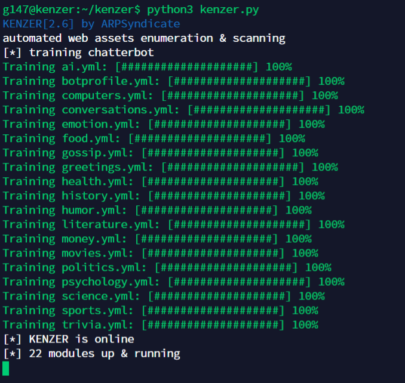
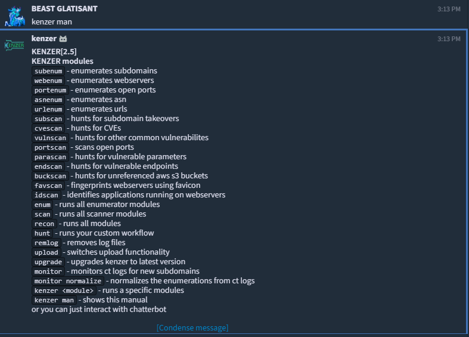

# KENZER | Automated web assets enumeration & scanning

## Screenshots

## Instructions for running
1. Create an account on [Zulip](https://zulipchat.com) 
2. Navigate to `Settings > Your Bots > Add a new bot` 
3. Create a new generic bot named `kenzer` 
4. Add all the configurations in `configs/kenzer.conf` 
5. Install/Run using -  
    * `./install.sh -binaries` [if you need `kenzer-compatible` binaries to be installed] 
    * `./install.sh` [if you do not need `kenzer-compatible` binaries to be installed] 
    * `./run.sh` [if you do not need installation at all] 
6. Interact with `kenzer` using Zulip client, by adding bot to a stream or via DM. 
7. Test `kenzer man` as Zulip input to display available commands. 

## Built-in Functionalities
>* `subenum` - enumerates subdomains
>* `webenum` - enumerates webservers
>* `portenum` - enumerates open ports
>* `asnenum` - enumerates asn
>* `dnsenum` - enumerates dns records
>* `conenum` - enumerates hidden files & directories
>* `urlenum` - enumerates urls
>* `subscan` - hunts for subdomain takeovers
>* `cscan` - scan with customized templates
>* `cvescan` - hunts for CVEs
>* `vulnscan` - hunts for other common vulnerabilites
>* `portscan` - scans open ports
>* `parascan` - hunts for vulnerable parameters
>* `endscan` - hunts for vulnerable endpoints
>* `buckscan` - hunts for unreferenced aws s3 buckets
>* `favscan` - fingerprints webservers using favicon
>* `vizscan` - screenshots applications running on webservers
>* `idscan` - identifies applications running on webservers
>* `enum` - runs all enumerator modules
>* `scan` - runs all scanner modules
>* `recon` - runs all modules
>* `hunt` - runs your custom workflow
>* `remlog` - removes log files
>* `upload` - switches upload functionality
>* `upgrade` - upgrades kenzer to latest version
>* `monitor` - monitors ct logs for new subdomains
>* `monitor normalize` - normalizes the enumerations from ct logs
>* `sync` - synchronizes the local kenzerdb with github
>* `kenzer <module>` - runs a specific modules
>* `kenzer man` - shows this manual

**COMPATIBILITY TESTED ON ARCHLINUX(x64) & DEBIAN(x64) ONLY** 
**FEEL FREE TO SUBMIT PULL REQUESTS**
